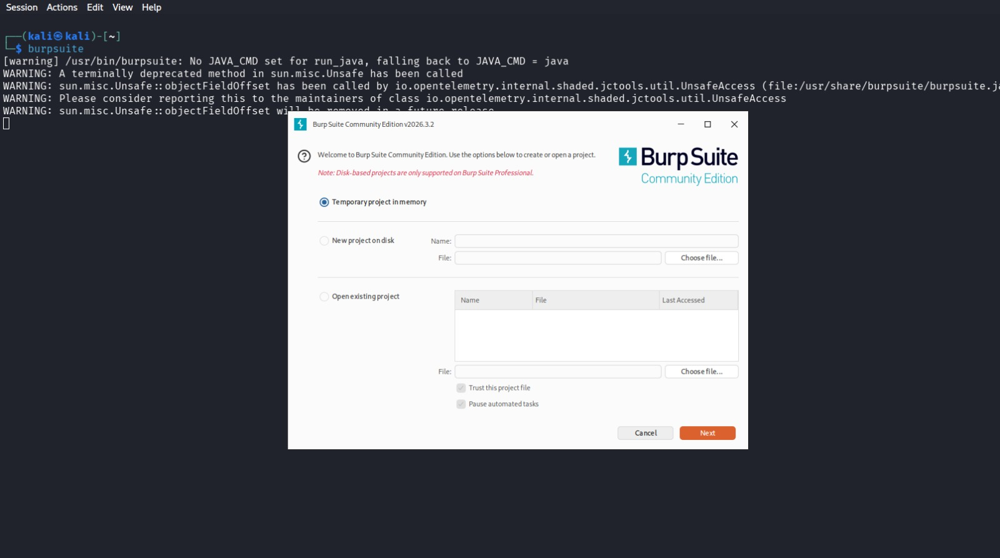

# Burp Suite

## Overview

Burp Suite is a widely used web application security testing platform developed by PortSwigger. It acts as an intercepting proxy between a web browser and a target application, allowing security professionals to capture, inspect, modify, and replay HTTP/HTTPS requests. Burp Suite is an essential tool for web penetration testing and vulnerability assessment.

---

## Purpose / Uses

- **Intercept HTTP/HTTPS Traffic** – Capture and modify web requests and responses.
- **Manual Security Testing** – Analyze application behavior using tools like Repeater and Decoder.
- **Web Application Scanning** – Identify vulnerabilities in web applications (Professional Edition).
- **Traffic Analysis** – Inspect headers, cookies, authentication tokens, and parameters.

---

## Installation

### Kali Linux

✅ **Preinstalled in Kali Linux (Community Edition)**

Verify installation:

```bash
burpsuite --version
```

Launch Burp Suite:

```bash
burpsuite
```

If not installed:

```bash
sudo apt update
sudo apt install burpsuite -y
```

---

## Basic Commands

### 1. Launch Burp Suite

```bash
burpsuite
```

Opens the Burp Suite graphical interface.

---

### 2. Configure Browser Proxy

```
Proxy Address : 127.0.0.1
Port          : 8080
```

Configures the browser to send traffic through Burp Suite.

---

### 3. Intercept Requests

```
Proxy → Intercept → Intercept is ON
```

Captures HTTP requests before they reach the server.

---

### 4. Send Request to Repeater

```
Right Click → Send to Repeater
```

Allows manual modification and replay of requests.

---

## Example Usage

1. Launch Burp Suite.

```bash
burpsuite
```

2. Configure your browser to use:

```
127.0.0.1:8080
```

3. Visit the target website.

4. Burp Suite captures the HTTP request.

5. Modify parameters and forward the request.

---

## Screenshot

```markdown

```

---

## GitHub Repository

Burp Suite is **not open source**, so there is **no official GitHub repository**.

**Official Website**

https://portswigger.net/burp

**Official Documentation**

https://portswigger.net/burp/documentation

**Kali Tools Page**

https://www.kali.org/tools/burpsuite/

---

## Advantages

- Industry-standard web security testing tool.
- Powerful interception proxy.
- Includes Repeater, Intruder, Decoder, Comparer, and Proxy modules.
- Extensive extension ecosystem through the BApp Store.
- Supports manual and automated testing.

---

## Limitations

- Advanced scanning features require the Professional Edition.
- Large number of tools can be overwhelming for beginners.
- Requires browser proxy configuration.
- Automated vulnerability scanner is unavailable in the Community Edition.

---

## References

- PortSwigger Burp Suite Documentation
- Kali Linux Tools Documentation
- OWASP Web Security Testing Guide
