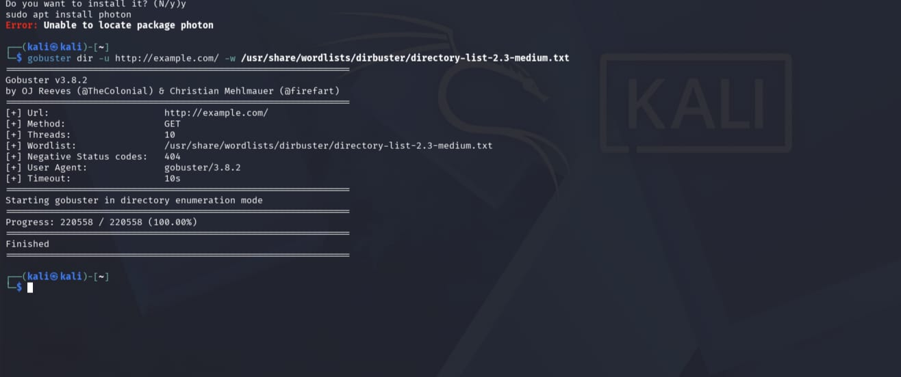

# Gobuster

## Overview

Gobuster is a fast, command-line tool written in Go used to brute-force URIs (directories and files), DNS subdomains, Virtual Host (VHost) names, and Amazon S3 buckets. It is widely used by penetration testers and security professionals during the reconnaissance and enumeration phases of a security assessment.

---

## Purpose / Uses

- **Directory and File Brute-Forcing** – Discover hidden directories and files on web servers.
- **DNS Subdomain Enumeration** – Identify subdomains using a wordlist.
- **Virtual Host (VHost) Discovery** – Find virtual hosts configured on a web server.
- **Amazon S3 Bucket Enumeration** – Detect publicly accessible S3 buckets.

---

## Installation

### Kali Linux

✅ **Preinstalled in Kali Linux**

Verify installation:

```bash
gobuster -h
```

If not installed:

```bash
sudo apt update
sudo apt install gobuster -y
```

---

## Basic Commands

### 1. Directory Enumeration

```bash
gobuster dir -u http://target.com -w /path/to/wordlist.txt
```

**Explanation**

- `dir` – Directory enumeration mode.
- `-u` – Target URL.
- `-w` – Wordlist used for brute-forcing.

---

### 2. DNS Subdomain Enumeration

```bash
gobuster dns -d target.com -w /path/to/subdomains.txt
```

**Explanation**

- `dns` – DNS enumeration mode.
- `-d` – Target domain.
- `-w` – Wordlist containing possible subdomains.

---

## Example Usage

### Discover Hidden Directories

```bash
gobuster dir -u http://example.com -w /usr/share/wordlists/dirb/common.txt
```

**Expected Output**

```
===============================================================
Gobuster v3.x
===============================================================
/admin               (Status: 301)
/login               (Status: 200)
/uploads             (Status: 403)
/robots.txt          (Status: 200)
===============================================================
```
---

## Screenshot

```markdown

```

---

## Advantages

- High execution speed due to Go's concurrency.
- Supports multiple enumeration modes (Directory, DNS, VHost, S3).
- Lightweight and easy to use.
- Ideal for reconnaissance and web content discovery.
- Open-source and actively maintained.

---

## Limitations

- Does not perform recursive crawling automatically.
- Limited HTTP request customization compared to advanced fuzzers like FFUF.
- Requires quality wordlists for effective results.
- Can generate a large number of requests, potentially triggering rate limits or web application firewalls (WAFs).

---

## References

- Official Gobuster Documentation
- Gobuster GitHub Repository
- Kali Linux Tools Documentation
