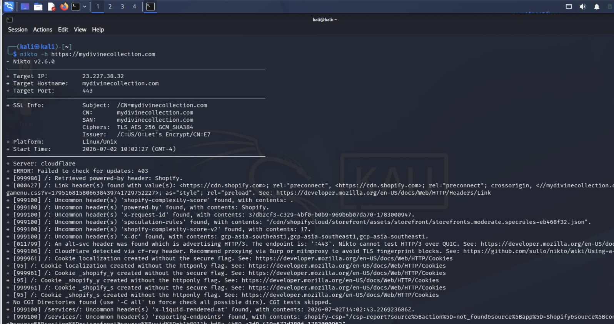

# Nikto

## Overview

Nikto is an open-source web server vulnerability scanner written in Perl. It performs comprehensive security checks against web servers to identify dangerous files, outdated software, insecure configurations, default files, and known vulnerabilities. Nikto is commonly used during the vulnerability assessment phase of penetration testing.

---

## Purpose / Uses

- **Web Server Vulnerability Assessment** – Detect known vulnerabilities, dangerous files, and outdated software.
- **Server Misconfiguration Detection** – Identify insecure server configurations and enabled HTTP methods.
- **Security Auditing** – Check for default files, backup files, and exposed administrative interfaces.

---

## Installation

### Kali Linux

✅ **Preinstalled in Kali Linux**

Verify installation:

```bash
nikto -Version
```

If not installed:

```bash
sudo apt update
sudo apt install nikto -y
```

---

## Basic Commands

### 1. Display Help

```bash
nikto -Help
```

### 2. Scan a Target Website

```bash
nikto -h http://target.com
```

**Explanation**

- `-h` – Specifies the target host or URL.

---

### 3. Scan HTTPS Website

```bash
nikto -h https://target.com
```

---

### 4. Save Scan Results

```bash
nikto -h http://target.com -o report.html -Format html
```

**Explanation**

- `-o` – Output filename.
- `-Format` – Output format (html, csv, txt, xml).

---

## Example Usage

```bash
nikto -h http://example.com
```

**Expected Output**

```
Target IP: 192.168.x.x
Server: Apache/2.4.x
Found /phpinfo.php
Missing Security Headers
Outdated Apache Version
```

---

## Screenshot

```markdown

```

---

## GitHub Repository

**Official GitHub**

https://github.com/sullo/nikto

**Official Documentation**

https://github.com/sullo/nikto/wiki

**Kali Tools Page**

https://www.kali.org/tools/nikto/

---

## Advantages

- Detects thousands of known vulnerabilities.
- Identifies insecure configurations.
- Supports multiple report formats.
- Frequently updated vulnerability database.
- Easy to use.

---

## Limitations

- Generates noisy network traffic.
- Can be blocked by Web Application Firewalls (WAFs).
- Produces false positives occasionally.
- Does not exploit vulnerabilities.

---

## References

- Official Nikto Documentation
- Nikto GitHub Repository
- Kali Linux Tools Documentation
