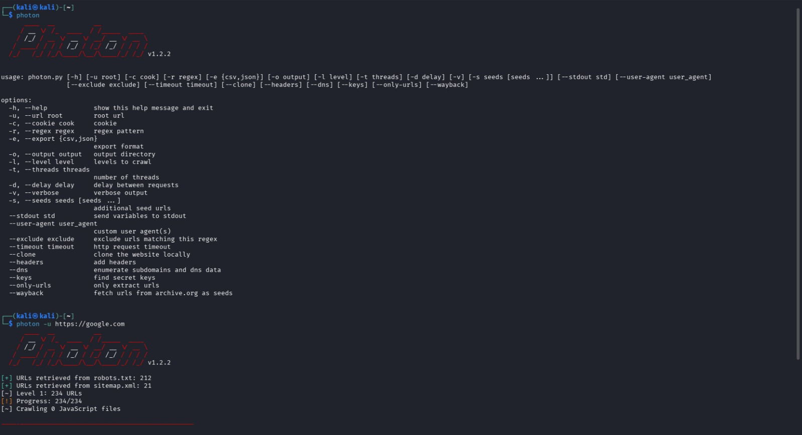

# Photon

## Overview

Photon is a fast Python-based web crawler and OSINT tool designed to crawl websites and collect URLs, JavaScript files, endpoints, parameters, emails, subdomains, API keys, and other publicly accessible information. It is widely used during reconnaissance to map a web application's attack surface.

---

## Purpose / Uses

- **Website Crawling** – Discover internal and external links.
- **OSINT Collection** – Gather emails, subdomains, and technology information.
- **Endpoint Discovery** – Find hidden URLs and API endpoints.
- **Parameter Discovery** – Identify GET and POST parameters for security testing.

---

## Installation

### Kali Linux

❌ Not preinstalled in some Kali installations.

Install Photon using:

```bash
sudo apt update
sudo apt install photon -y
```

Verify installation:

```bash
photon -h
```

Clone the repository:

```bash
git clone https://github.com/s0md3v/Photon.git
```

Install dependencies:

```bash
cd Photon
pip3 install -r requirements.txt
```

Verify installation:

```bash
python3 photon.py -h
```

---

## Basic Commands

### 1. Display Help

```bash
python3 photon.py -h
```

---

### 2. Crawl a Website

```bash
python3 photon.py -u http://target.com
```

**Explanation**

- `-u` – Target URL.

---

### 3. Increase Crawl Depth

```bash
python3 photon.py -u http://target.com -l 3
```

**Explanation**

- `-l` – Crawl depth level.

---

## Example Usage

```bash
python3 photon.py -u https://example.com
```

**Expected Output**

```
Collected URLs
JavaScript Files
Email Addresses
Internal Links
API Endpoints
```

---

## Screenshot

```markdown

```

---

## GitHub Repository

**Official GitHub**

https://github.com/s0md3v/Photon

**Documentation**

https://github.com/s0md3v/Photon

---

## Advantages

- Extremely fast web crawler.
- Discovers endpoints and parameters.
- Collects emails and subdomains.
- Lightweight and open source.
- Useful for reconnaissance.

---

## Limitations

- JavaScript-heavy websites may not be fully crawled.
- Cannot detect non-web services.
- Results depend on website accessibility.
- Some dynamic content may be missed.

---

## References

- Official Photon GitHub Repository
- OWASP Web Security Testing Guide
