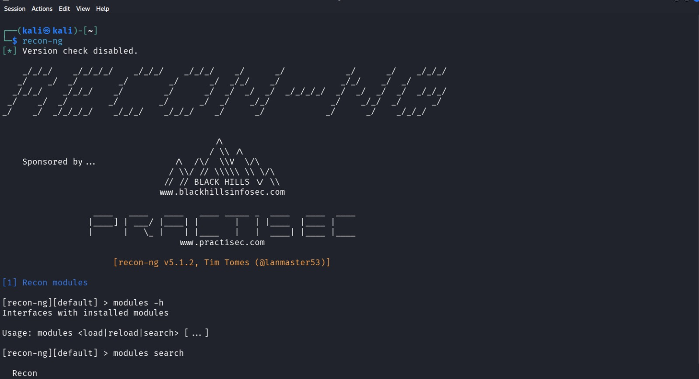

# Recon-ng

## Overview

Recon-ng is a powerful web reconnaissance framework written in Python. Inspired by the Metasploit Framework, it provides a modular environment for Open Source Intelligence (OSINT) gathering by automating reconnaissance tasks using search engines, APIs, databases, and other public information sources. It stores collected data in a local SQLite database for easy management and analysis.

---

## Purpose / Uses

- **Comprehensive OSINT Gathering** – Collect information about domains, hosts, contacts, and organizations.
- **Centralized Data Storage** – Store reconnaissance results in a local SQLite database.
- **Threat Intelligence Automation** – Use built-in modules to query public intelligence sources and APIs.
- **Reconnaissance Workflow Management** – Organize projects using workspaces and modules.

---

## Installation

### Kali Linux

✅ **Preinstalled in Kali Linux**

Verify installation:

```bash
recon-ng --version
```

If not installed:

```bash
sudo apt update
sudo apt install recon-ng -y
```

---

## Basic Commands

### 1. Launch Recon-ng

```bash
recon-ng
```

Launches the interactive Recon-ng framework.

---

### 2. Create a Workspace

```bash
workspaces create example
```

Creates a new workspace to store reconnaissance data.

---

### 3. List Available Modules

```bash
marketplace search
```

Displays available modules from the marketplace.

---

### 4. Load a Module

```bash
modules load recon/domains-hosts/bing_domain_web
```

Loads the selected reconnaissance module.

---

### 5. Run the Module

```bash
run
```

Executes the loaded module.

---

## Example Usage

```bash
recon-ng
```

Inside the framework:

```text
workspaces create example
modules load recon/domains-hosts/bing_domain_web
options set SOURCE example.com
run
```

**Expected Output**

```
Hosts Found:
mail.example.com
vpn.example.com
dev.example.com

Results saved to workspace database.
```

---

## Screenshot

```markdown

```

---

## GitHub Repository

**Official GitHub**

https://github.com/lanmaster53/recon-ng

**Official Documentation**

https://github.com/lanmaster53/recon-ng/wiki

**Kali Tools Page**

https://www.kali.org/tools/recon-ng/

---

## Advantages

- Modular framework similar to Metasploit.
- Stores reconnaissance data in an SQLite database.
- Supports dozens of OSINT modules.
- Organizes projects using workspaces.
- Easily extensible through the module marketplace.

---

## Limitations

- Many modules require API keys.
- Interactive interface has a learning curve.
- Some third-party APIs may become unavailable.
- Results depend on publicly available information.

---

## References

- Official Recon-ng Documentation
- Recon-ng GitHub Repository
- Kali Linux Tools Documentation
- OWASP Web Security Testing Guide
