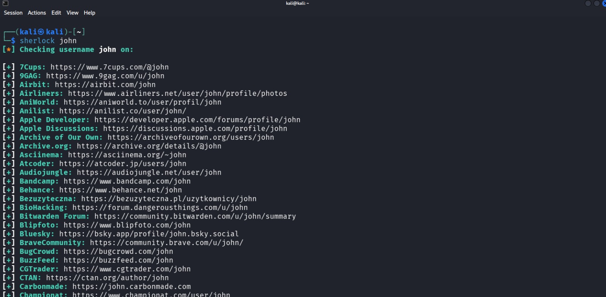

# Sherlock

## Overview

Sherlock is an open-source OSINT tool written in Python that searches for usernames across hundreds of social networking platforms. It helps investigators, penetration testers, and security researchers identify a user's online presence using a single username.

---

## Purpose / Uses

- **Username Enumeration** – Search for usernames across hundreds of websites.
- **Digital Footprint Analysis** – Identify an individual's online presence.
- **Threat Intelligence** – Gather OSINT during investigations.
- **Brand Protection** – Check whether organization names or brands are registered on public platforms.

---

## Installation

### Kali Linux

Verify installation:

```bash
sherlock --help
```

If not installed:

```bash
sudo apt update
sudo apt install sherlock -y
```

Or install from GitHub:

```bash
git clone https://github.com/sherlock-project/sherlock.git
cd sherlock
pip3 install -r requirements.txt
```

---

## Basic Commands

### 1. Display Help

```bash
sherlock --help
```

---

### 2. Search for a Username

```bash
sherlock targetusername
```

**Explanation**

- `targetusername` – Username to search across supported websites.

---

## Example Usage

```bash
sherlock johndoe
```

**Expected Output**

```
[+] GitHub: Found
[+] Reddit: Found
[+] Twitter: Found
[-] Facebook: Not Found
```

---

## Screenshot

```markdown

```

---

## GitHub Repository

**Official GitHub**

https://github.com/sherlock-project/sherlock

**Documentation**

https://github.com/sherlock-project/sherlock

**Kali Tools Page**

https://www.kali.org/tools/sherlock/

---

## Advantages

- Searches hundreds of social media platforms.
- No API keys required.
- Fast and easy to use.
- Open source and actively maintained.
- Supports exporting results.

---

## Limitations

- Username matches do not confirm identity.
- Some websites may block automated requests.
- Large searches may trigger rate limiting.
- Results depend on supported platforms.

---

## References

- Official Sherlock GitHub Repository
- Kali Linux Tools Documentation
- OSINT Framework
