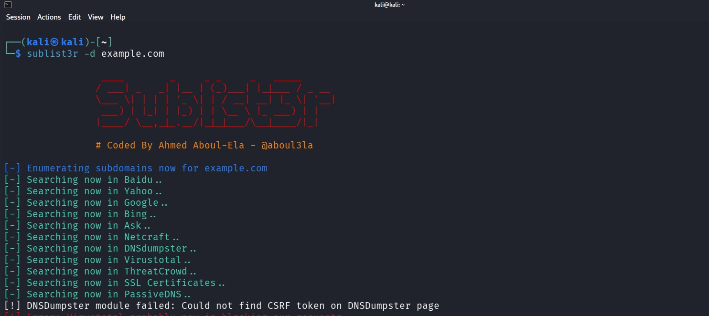

# Sublist3r

## Overview

Sublist3r is an open-source Python-based OSINT tool used to enumerate subdomains of a target domain. It gathers information from multiple public sources such as search engines, SSL/TLS certificate transparency logs, DNS records, and other online services, making it a valuable reconnaissance tool for penetration testers and bug bounty hunters.

---

## Purpose / Uses

- **Subdomain Enumeration** – Discover publicly available subdomains of a target domain.
- **Passive Resource Discovery** – Identify development, staging, and internal-facing subdomains exposed online.
- **Subdomain Takeover Assessment** – Find abandoned subdomains that may be vulnerable to takeover.
- **Attack Surface Mapping** – Expand the target's attack surface before vulnerability assessment.

---

## Installation

### Kali Linux

✅ **Preinstalled in Kali Linux**

Verify installation:

```bash
sublist3r -h
```

If not installed:

```bash
sudo apt update
sudo apt install sublist3r -y
```

---

## Basic Commands

### 1. Display Help

```bash
sublist3r -h
```

**Explanation**

Displays all available command-line options.

---

### 2. Enumerate Subdomains

```bash
sublist3r -d example.com
```

**Explanation**

- `-d` – Specifies the target domain.

---

### 3. Save Results to a File

```bash
sublist3r -d example.com -o subdomains.txt
```

**Explanation**

- `-o` – Saves discovered subdomains to a text file.

---

## Example Usage

### Enumerate Subdomains

```bash
sublist3r -d example.com
```

**Expected Output**

```
[-] Enumerating subdomains now...
www.example.com
mail.example.com
vpn.example.com
dev.example.com
api.example.com
```

---

## Screenshot

```markdown

```

---

## Advantages

- Collects data from multiple OSINT sources.
- Fast passive reconnaissance with minimal interaction.
- Supports output to files.
- Includes optional brute-force functionality.
- Open-source and widely used by security professionals.

---

## Limitations

- Depends on third-party search engines and APIs.
- Results vary depending on publicly indexed information.
- Some sources may stop working when their APIs or layouts change.
- Cannot discover strictly internal or private subdomains.

---

## References

- Official Sublist3r GitHub Repository
- Kali Linux Tools Documentation
- OWASP Web Security Testing Guide 
